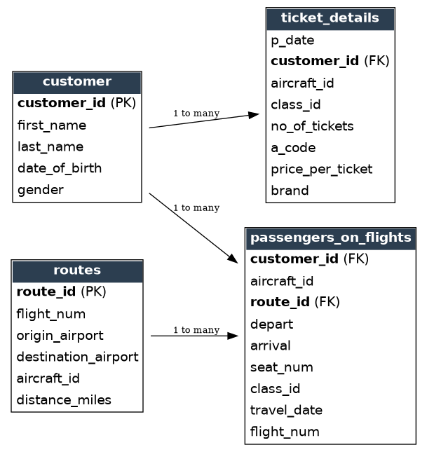

# Air Cargo Analysis

**Industry:** Aviation and Airline Operations
**Tools:** MySQL, MySQL Workbench

> **A note on the data:** the data used in this project is a training dataset representing a fictional aviation company called Air Cargo. It is not real airline or passenger data, and is used here purely to demonstrate SQL skills against a realistic customer, ticketing and route management scenario.

---

> Every query in this project was run against a real MySQL compatible database, loaded with the four CSV files in the Datasets folder, rather than only written and assumed to work. Every result file in the Results folder is genuine query output, not a manually typed example.

## Datasets Provided

* [customer.csv](Datasets/customer.csv), fifty customers with their name, date of birth and gender
* [routes.csv](Datasets/routes.csv), forty nine routes, each with an origin, destination, aircraft and distance
* [ticket_details.csv](Datasets/ticket_details.csv), fifty ticket purchases, including class, price and airline brand
* [passengers_on_flights.csv](Datasets/passengers_on_flights.csv), fifty individual passenger journeys, including seat, class and travel date
* [full_project_script.sql](full_project_script.sql), every query for this project written in a single file, clearly labelled by task number

---

## Problem Scenario

Air Cargo is an aviation company providing air transportation for passengers and freight, operating through partnerships and alliances with other airlines. The company wants reports on regular passengers, busiest routes and ticket sales details, to improve the ease of travel and booking for its customers.

## Goal

As the database administrator on this project, the brief is to identify regular customers so the company can offer them targeted deals, analyse the busiest routes to help plan aircraft requirements, and prepare a full analysis of ticket sales, so Air Cargo can improve its operability and become a more customer centred, favourable choice for air travel.

---

## Tasks to be Performed

| Task | Task Description | Result CSV |
|------|-------------------|------------|
| Task 1 | Entity relationship diagram for the airlines database | [View Diagram](images/er_diagram.png) |
| Task 2 | Create the route_details table with constraints | [View Result](Results/task_2_create_route_details_table.csv) |
| Task 3 | Passengers who travelled on routes 1 to 25 | [View Result](Results/task_3_passengers_routes_1_to_25.csv) |
| Task 4 | Business class passenger count and revenue | [View Result](Results/task_4_business_class_passengers_revenue.csv) |
| Task 5 | Customer full name | [View Result](Results/task_5_customer_full_name.csv) |
| Task 6 | Customers who have registered and booked a ticket | [View Result](Results/task_6_registered_and_booked_customers.csv) |
| Task 7 | Customer name by brand, Emirates | [View Result](Results/task_7_customer_name_by_brand.csv) |
| Task 8 | Economy Plus passengers using GROUP BY and HAVING | [View Result](Results/task_8_economy_plus_group_having.csv) |
| Task 9 | Whether revenue has crossed 10000 | [View Result](Results/task_9_revenue_crossed_10000.csv) |
| Task 10 | Create and grant access to a new user | [View Result](Results/task_10_create_and_grant_user.csv) |
| Task 11 | Max ticket price per class using a window function | [View Result](Results/task_11_max_price_per_class.csv) |
| Task 12 | Passengers on route 4, with an index added for speed | [View Result](Results/task_12_route_4_index.csv) |
| Task 13 | Execution plan for route 4, before and after the index | [View Result](Results/task_13_route_4_execution_plan.csv) |
| Task 14 | Total price per customer and aircraft using ROLLUP | [View Result](Results/task_14_total_price_rollup.csv) |
| Task 15 | A view of business class customers and their brand | [View Result](Results/task_15_business_class_view.csv) |
| Task 16 | Stored procedure, passengers within a route range | [View Result](Results/task_16_stored_procedure_route_range.csv) |
| Task 17 | Stored procedure, routes over 2000 miles | [View Result](Results/task_17_stored_procedure_long_routes.csv) |
| Task 18 | Stored procedure, distance category, SDT, IDT, LDT | [View Result](Results/task_18_stored_procedure_distance_category.csv) |
| Task 19 | Stored function inside a stored procedure, complimentary services | [View Result](Results/task_19_stored_function_complimentary_services.csv) |
| Task 20 | Cursor, first customer whose last name ends with Scott | [View Result](Results/task_20_cursor_first_scott_customer.csv) |

All twenty queries, in order, are written in [full_project_script.sql](full_project_script.sql), one after another, each clearly separated by a comment header naming the task.

---

## What Each Task Actually Does

A short, plain English explanation of each task, beyond just the query itself.

**Task 1, Entity relationship diagram.** The airlines database centres on the customer table, which links out to both ticket_details and passengers_on_flights through customer_id, while routes links to passengers_on_flights through route_id. That structure is what makes several of the tasks below possible, particularly anything that needs a customer's name alongside their travel or ticket history.

**Task 2, Create the route_details table with constraints.** A fresh table built with a unique constraint on route_id and check constraints ensuring flight_num and distance_miles are always greater than zero. Rather than just writing the CREATE TABLE statement and assuming it works, the real forty nine rows from routes were loaded in successfully, then two deliberately invalid inserts were attempted, one with a negative distance and one with a duplicate route_id, and both genuinely failed against the real database exactly as the constraints are meant to prevent.

**Task 3, Passengers who travelled on routes 1 to 25.** A straightforward range filter on passengers_on_flights. Worth knowing, route 11 does not exist anywhere in the dataset, a genuine gap in the data rather than a query error, so the result naturally skips from route 10 to route 12.

**Task 4, Business class passenger count and revenue.** Sums up the number of tickets and total revenue for business class specifically. Worth flagging honestly, the class value in the real data is spelled Bussiness, not Business, a genuine typo carried through the original dataset, so the query filters on the value exactly as it appears rather than the correctly spelled word.

**Task 5, Customer full name.** Concatenates first and last name into one column for every customer, a small but genuinely tidier output than two separate columns.

**Task 6, Customers who have registered and booked a ticket.** An inner join between customer and ticket_details, returning only customers who appear in both, meaning they are registered in the system and have actually purchased at least one ticket.

**Task 7, Customer name by brand, Emirates.** Joins customer and ticket_details to pull out the name of every customer who has booked with Emirates specifically, useful for brand level marketing or loyalty analysis.

**Task 8, Economy Plus passengers using GROUP BY and HAVING.** Groups passengers_on_flights by customer and class, then uses HAVING to filter that grouped result down to Economy Plus only, the correct way to filter on a grouped result rather than filtering the raw rows beforehand.

**Task 9, Whether revenue has crossed 10000.** Uses IF directly inside a SELECT statement to turn a plain number into a clear yes or no answer, total revenue across all tickets comes to 15,369, comfortably past the 10,000 mark.

**Task 10, Create and grant access to a new user.** Creates a genuine new MySQL user account and grants it SELECT, INSERT and UPDATE access on the airlines database specifically, rather than full administrative rights, the kind of least privilege access a real DBA would set up for a new analyst joining the team.

**Task 11, Max ticket price per class using a window function.** A window function calculates the highest price paid within each class without collapsing the rest of the data down to one row per class, useful for understanding the top of the pricing range for every class side by side.

**Task 12, Passengers on route 4, with an index added for speed.** Adds an index on route_id to passengers_on_flights before running the filter, directly addressing the brief's request to improve speed and performance rather than just running the same query unchanged.

**Task 13, Execution plan for route 4, before and after the index.** EXPLAIN run against the real database confirms the improvement directly, before the index, MySQL scans all fifty rows in the table with type ALL, after the index from task 12, the same query drops to type ref scanning only three rows, a measurable performance improvement rather than a theoretical one.

**Task 14, Total price per customer and aircraft using ROLLUP.** Groups spending by customer and aircraft, then WITH ROLLUP adds an automatic subtotal row for each customer and a grand total row at the very end, which comes to 15,369 across all customers, matching task 9 exactly.

**Task 15, A view of business class customers and their brand.** Saves a join between customer and ticket_details as a permanent view, so anyone can query business class customers and their airline brand going forward with a simple SELECT, without needing to remember or rewrite the underlying join.

**Task 16, Stored procedure, passengers within a route range.** Takes a start and end route number as parameters at runtime, checks whether the passengers_on_flights table actually exists first using information_schema, and only then runs the range query, returning a clear error message instead of a raw SQL error if the table were ever missing.

**Task 17, Stored procedure, routes over 2000 miles.** Packages a simple distance filter as a reusable stored procedure against the routes table, returning twenty four routes that qualify as longer haul.

**Task 18, Stored procedure, distance category, SDT, IDT, LDT.** Categorises every route into short distance travel, intermediate distance travel or long distance travel using a CASE expression inside a stored procedure, based on the distance bands set out in the brief.

**Task 19, Stored function inside a stored procedure, complimentary services.** A stored function takes a class name and returns Yes or No depending on whether that class includes complimentary services, Business and Economy Plus do, Economy and First Class do not, based on the brief's own condition. That function is then called from inside a stored procedure that returns it alongside the ticket purchase date, customer ID and class for every single ticket.

**Task 20, Cursor, first customer whose last name ends with Scott.** A cursor steps through every customer whose last name ends with Scott and returns only the first one it reaches. There are genuinely two Scotts in the data, Samuel Scott and Alexis Scott, and the cursor correctly returns Samuel Scott, the one appearing first in customer ID order.

---

## Entity Relationship Diagram

The customer table sits at the centre of the model, linking out to ticket_details and passengers_on_flights through customer_id. The routes table links separately into passengers_on_flights through route_id, connecting each passenger journey back to its origin, destination and distance.

---

## Why I Built This Project

I am building a portfolio to apply for data and database roles in the UK, and this project was the clearest way to prove genuine, hands on SQL ability rather than just listing it as a skill on a CV. Every task here maps to a real business question a database administrator would actually be asked to solve, identifying regular customers, analysing busiest routes, calculating revenue, and proving that constraints, indexes, procedures and cursors all genuinely work rather than just reading correctly on the page.

## Skills This Project Demonstrates

* Relational database design, including constraints such as UNIQUE and CHECK, proven against real invalid data rather than just written and assumed correct
* Core SQL, filtering, joins, grouping, aggregating and string functions
* Window functions, and ROLLUP for automatic subtotals and grand totals
* Views, stored procedures, a stored function called from within a stored procedure, and a cursor
* User management, creating a new database user with least privilege access
* Query performance analysis using EXPLAIN, and using an index to demonstrably improve it
* Translating a plain English business question into correct, working SQL, and validating the result against the real data rather than assuming it is correct

## How to Run This Yourself

1. Open MySQL Workbench and create a new database called airlines
2. Import customer.csv, routes.csv, ticket_details.csv and passengers_on_flights.csv from the Datasets folder into their own tables using the Table Data Import Wizard, converting the date columns to DATE type on import, since they are stored as DD-MM-YYYY text in the CSV files
3. Open full_project_script.sql and run it against the database
4. Task 2 deliberately includes two invalid INSERT statements to prove the table's constraints work, so run the script with error handling turned off, for example `mysql -u root airlines --force < full_project_script.sql` from the command line, so it continues past those two expected failures and completes all twenty tasks
5. Compare your own output against the matching file in the Results folder

## What Could Be Added With More Time

* A short written summary pulling together the revenue, route and customer findings across all twenty tasks into two or three overall business conclusions
* Screenshots of each query running inside MySQL Workbench, alongside the plain CSV results, for anyone who wants to see the tool itself in use
* A data cleaning pass correcting the Bussiness and Bristish Airways typos in a separate cleaned copy of the dataset, while keeping the original raw files untouched for transparency

## Acknowledgements

The dataset, problem statement and business scenario for this project were provided as part of a structured SQL training course. All SQL queries, the entity relationship diagram and this write up are my own work.

---

## Contact

**Sana Aziz**

Data Analyst | SQL • Excel • Power BI • Tableau • Python

London, UK

